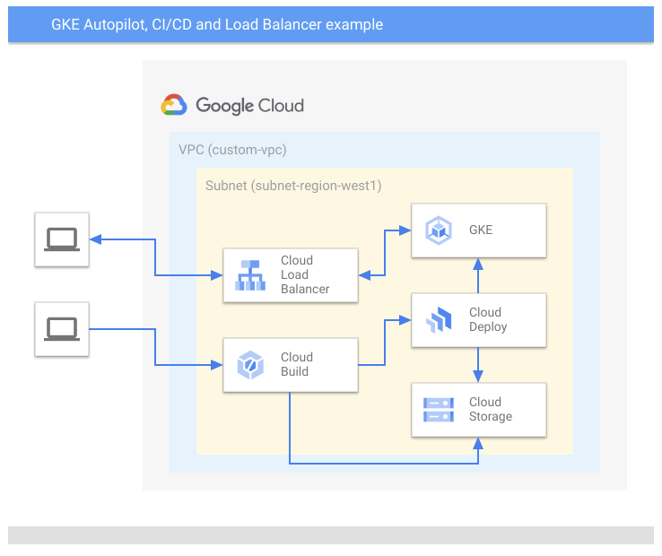
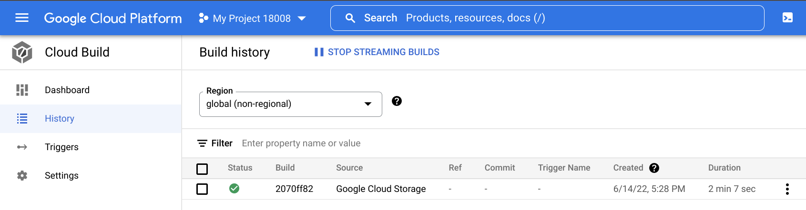
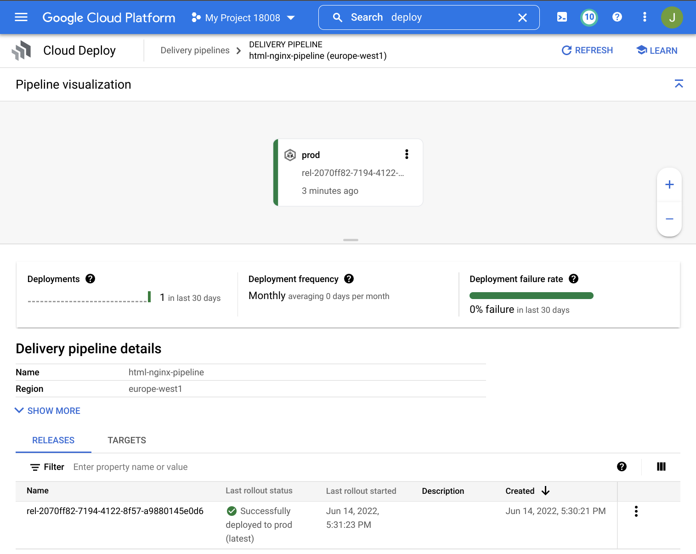
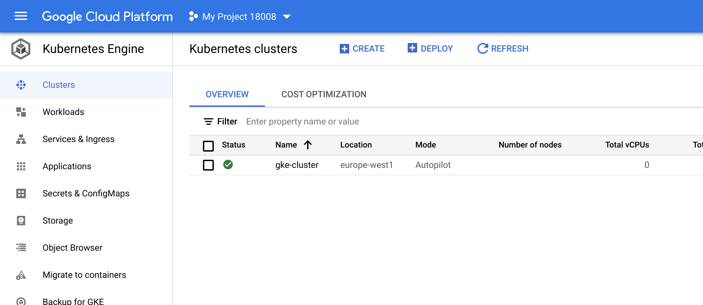
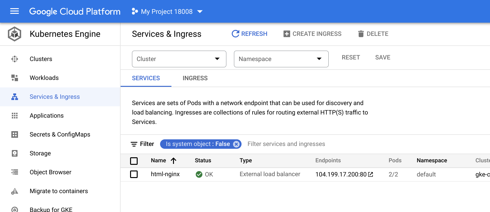
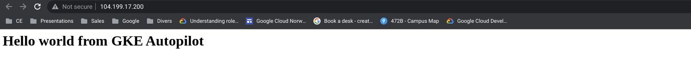

# gcp-gke-auto-ci-cd
Simple K8S (using [kustomize](https://kustomize.io/)) example using Terraform, CloudBuild, CloudDeploy, GKE Autopilot to deploy a simple web site from a docker container in GCP.


## Overall architecture




## Project structure
```
.
├── app (web application based on nginx)
│   ├── Dockerfile
│   └── index.html
├── cloudbuild.yaml (build sequence for Cloud Build)
├── clouddeploy.yaml (delivery pipeline for Cloud Deploy )
├── config.tf (services and provider)
├── deploy.sh (deploy script using gcloud command)
├── gke.tf (managed kubernetes cluster)
├── iam.tf (service accounts and roles)
├── imgs
│   ├── 0.png
│   ├── 1.png
│   ├── 2.png
│   ├── 3.png
│   ├── 4.png
│   └── 5.png
├── install.sh (install script for gcp api using gcloud command)
├── k8s (kubernetes config files, based on kustomize)
│   ├── base
│   │   ├── deployment.yaml
│   │   ├── hpa.yaml
│   │   ├── kustomization.yaml
│   │   └── service.yaml
│   └── overlays
│       └── prod
│           ├── deployment.yaml
│           ├── hpa.yaml
│           └── kustomization.yaml
├── network.tf (vpc and subnet)
├── README.md (this file)
├── skaffold.yaml (scaffold file for kustomize)
├── uninstall.sh (uninstall script using gcloud command)
└── vars.tf (variables configuration)
```

## Setup

1. Find out your GCP project's id and number from the dashboard in the cloud console, and update the following variables in the `terraform.tfvars.json` file. Replace `YOUR_PROJECT_NMR`, `YOUR_PROJECT_ID` and `YOUR_PROJECT_REGION` with the correct values. 


```shell
{
    "project_id": "YOUR_PROJECT_ID",
    "project_nmr": YOUR_PROJECT_NMR,
    "project_default_region": "YOUR_PROJECT_REGION"
}
```


2. In the file `clouddbuild.yaml` replace `YOUR_PROJECT_ID` and `YOUR_PROJECT_REGION` with the correct values. 


## Install

1. Run the following command at the root of the folder:
```shell 
$ ./install.sh
$ terraform init
$ terraform plan
$ terraform apply
```

> This will install 18 resources
> Note: You may have to run `terraform plan` and `terraform apply` twice if you get errors for serviceaccounts not found

2. Build and deploy the webserver image in GKE, by issuing the following command at the root of the project:

```shell
$ ./deploy.sh
```

> This will build a docker image using Cloud Build



> This will then deploy the image to GKE using Cloud Deploy




> This will also deploy a GKE Service of type LoadBalancer. 



2. Open the IP address of the LoadBalancer in a web browser and you should see the following:




## Uninstall


1. Run the following at the root of your project

```shell 
$ ./uninstall.sh
```

> All resources will now be removed from your project